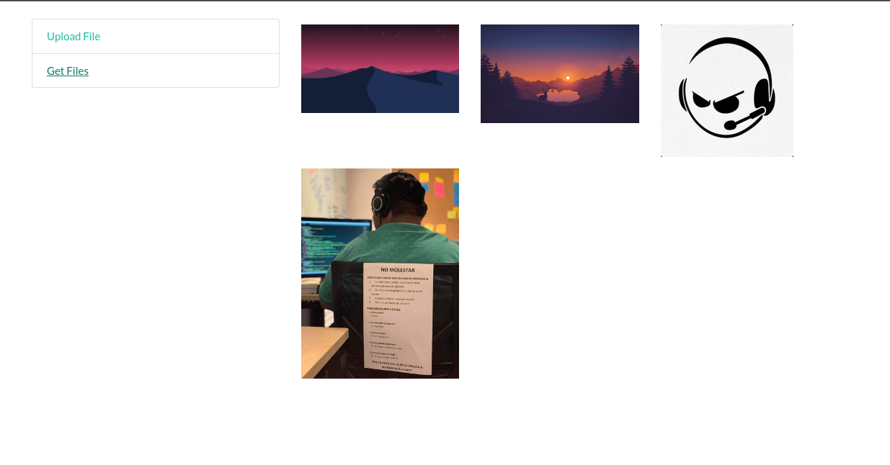

# S3 Image Upload

application to upload images to digital ocean and view them using mongoDB

## Screenshots



## Tools

- [NodeJs](https://expressjs.com/es/) - Express
- [Digital Ocean](https://www.digitalocean.com/) - Image storage
- [Heroku](https://dashboard.heroku.com/) - Deployment
- [MongoDB](https://www.mongodb.com/) - Image url storage

## Deployment

the application is shown in [heroku](https://dashboard.heroku.com/) at the following [link](https://nodejs-upload.herokuapp.com/)

## Run Locally

Clone the project

```bash
  git clone https://github.com/Deyvis17GY/upload-s3-nodejs.git
```

Go to the project directory

```bash
  cd upload-s3-nodejs
```

Install dependencies

```bash
  yarn install
```

Start the server

```bash
  yarn start
```

## Environment Variables

To run this project, you will need to add the following environment variables to your .env file

`PORT`

`MONGODB_URI`

`BUCKET_NAME`

`AWS_ACCESS_KEY_ID`

`AWS_SECRET_ACCESS_KEY`

`S3_ENPOINT`

## License

[MIT](https://choosealicense.com/licenses/mit/)
